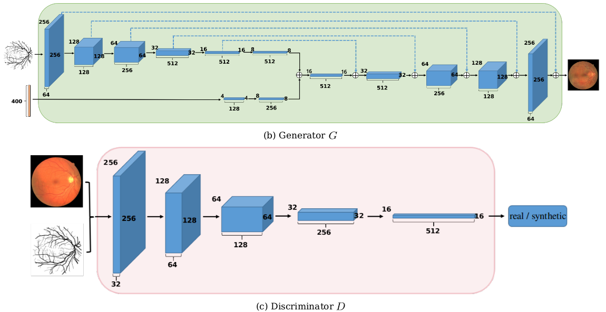

# Fila-sGAN-pytorch
The code is an pytorch implementation of [《Synthesizing Filamentary Structured Images with GANs》](https://arxiv.org/abs/1706.02185)

---

## Overview

### Data and Preprocess

[DRIVE: Digital Retinal Images for Vessel Extraction](http://www.isi.uu.nl/Research/Databases/DRIVE/) you can download the train data here. For generating more data for data augmentation, you can random crop some labels from other dataset, and put one image for style transfer in eyedata/train/style. 

### Model





### Training

python train.py

### Results


left is the style image and others are  my results.
---

## How to use

### Dependencies

This code depends on the following libraries:

* Python 3.6
* Pytorch
* PIL

### structure
```
 filps-gan
│
├── eyedata  # drive data
│ 
├── gycutils # my utils for data augmentation
│ 
├── Vgg.py # vgg net to style transfer
│ 
├── readmeDisplay  # some images for readme
│ 
├── datasets.py # dataset for dataloader
│ 
├── gan.py # generative adversial network for synthesize retina image
│ 
├── train.py # train code
│
├── transform.py 
│
└── readme.md # introduce to this project
```


